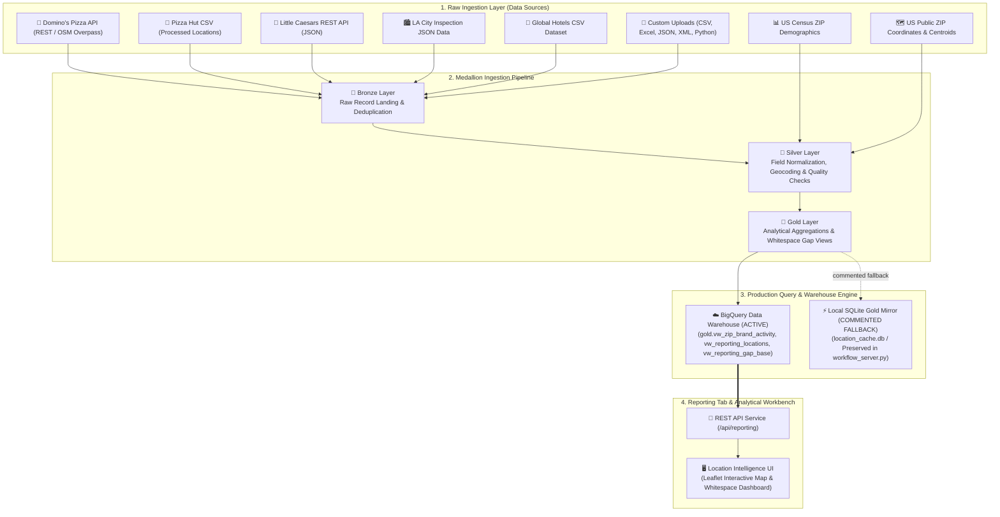

# Dataflow & Data Pipeline Architecture (DATAFLOW.md)

This document provides a comprehensive specification of the **Data Sources**, **Medallion Data Pipeline (Bronze $\rightarrow$ Silver $\rightarrow$ Gold)**, **BigQuery Analytics Views Storage Layer**, and **Reporting Computation Engine** powering the Location Intelligence platform.

---

## 1. Active Reporting Connection & Dataflow Architecture

> [!IMPORTANT]
> **Active Reporting Routing**: Reporting queries are routed directly to **BigQuery Analytics Views** (`gold.vw_zip_brand_activity`, `gold.vw_reporting_locations`, `gold.vw_reporting_gap_base`).
> The local SQLite Gold Mirror (`location_cache.db`) short-circuit logic in `whitespace_tool/workflow_server.py` (`reporting_summary()`, lines 2310-2323) is preserved in code as a commented fallback option.



---

## 2. Ingested Data Sources Inventory

The platform aggregates data from multiple brand sources and external reference datasets:

### A. Business & Brand Location Sources
1. **Domino's Pizza (`dominos_api.py` / `dominos_store_locator.py` / `dominos_overpass.py`)**:
   * **Protocol**: REST API GET & OpenStreetMap Overpass Client.
   * **Attributes**: Store ID, address, city, state, postal code, latitude, longitude, phone number.
2. **Pizza Hut (`pizza_hut_kaggle.py`)**:
   * **Protocol**: Processed CSV location dataset loader.
   * **Attributes**: Store key, street address, city, state, ZIP code, latitude, longitude.
3. **Little Caesars (`little_caesars_json.py`)**:
   * **Protocol**: REST API GET JSON endpoint.
   * **Attributes**: Location key, address, city, state, ZIP code, store hours.
4. **LA City Inspection Demo Data (`la_city`)**:
   * **Protocol**: Public API REST JSON dataset from the City of Los Angeles Open Data Portal.
   * **Attributes**: Restaurant/market inspection data, establishment name, address, city, state, ZIP.
5. **Global Hospitality & Hotels (`global_hotels`)**:
   * **Protocol**: Processed global hotel CSV dataset.
   * **Attributes**: Hotel name, street address, city, state, ZIP, country, latitude, longitude.
6. **User Custom Onboarded Sources**:
   * **Protocol**: Interactive uploads via CSV, Excel (`.xlsx`), JSON, XML, GET API, or custom Python Pyodide scripts executed in the browser.

### B. Geographic & Demographics Reference Sources
1. **US Census ZIP Demographics Connector (`whitespace_tool/sources/demographics.py`)**:
   * **Population Counts** (`population`): Powers the minimum population filter (`min_population`).
   * **Average Household Income** (`average_household_income`): Powers the target income filter (`min_income`).
   * **Median Age** (`median_age`): Powers the demographic age filter (`max_median_age`).
2. **Public US ZIP Geography Connector (`whitespace_tool/sources/public_us_zips_bigquery.py`)**:
   * **Spatial Centroids**: Latitude / Longitude coordinates for map markers and ZIP search typeahead.
   * **Hierarchical Regions**: State Code, State Name, County Name, City Name, 5-digit ZIP.

---

## 3. Medallion Data Processing Pipeline

The system processes ingested records through a **Medallion Data Architecture**:

### 1. Bronze Layer (Raw Landing)
* Accepts unstructured raw records from API responses, CSV rows, or JSON arrays.
* Assigns unique `content_hash` identifiers to enforce strict idempotent ingestion.
* Filters duplicate submissions using content-based row hashing.

### 2. Silver Layer (Cleaned & Normalized)
* Applies standard field normalization:
  * String sanitization and title casing.
  * 5-digit US ZIP code padding (e.g., `9021` $\rightarrow$ `09021`).
  * Latitude / Longitude numeric validation ($\text{Lat} \in [-90, 90]$, $\text{Lng} \in [-180, 180]$).
* Executes Quality Control checks (`whitespace_tool.analytics.data_quality`):
  * Missing address detection.
  * Out-of-bounds coordinate checks.
  * Non-US location filtering.

### 3. Gold Layer (BigQuery Analytics Views)
The Gold layer models data for instant analytical querying across five core views:

| Gold View Name | Target Purpose | Primary Columns / Aggregations |
| :--- | :--- | :--- |
| `vw_zip_brand_activity` | ZIP-level brand penetration & demographics | `zip_code`, `zip_state`, `city_name`, `county`, `population`, `income`, `brand_count` |
| `vw_reporting_locations` | Geocoded store locations for Leaflet Map | `location_key`, `brand_name`, `address`, `latitude`, `longitude`, `status` |
| `vw_reporting_gap_base` | Competitor Whitespace Opportunity analysis | `zip_code`, `competitor_brand_count`, `target_brand_count`, `whitespace_score` |
| `vw_reporting_filter_options` | Cascading geography dropdown filters | `distinct zip_state`, `county`, `city_name`, `zip_code` |
| `vw_brand_summary` | Executive brand summary & listing totals | `brand_name`, `total_stores`, `active_states_count`, `active_zips_count` |

---

## 4. Modular Server Architecture & Connection Dispatcher

* **Modular Server Subpackage (`whitespace_tool/server/`)**:
  * **`server/handler.py`**: Encapsulates `MapperHandler` HTTP server request class, static file serving, and static alias routing (`/constants.js`, `/js/*`).
  * **`server/dispatcher.py`**: Maps REST endpoints (`/api/*`) to domain route handlers (`auth`, `mapping`, `review`, `templates`, `system`, `reporting`).
  * **`server/runner.py`**: Controls server lifecycle, CLI argument parsing, port binding, and `serve()` loop.
* **Compatibility Facades (`whitespace_tool/workflow_server.py` & `whitespace_tool/facades/workflow_server.py`)**:
  * Re-exports `serve`, `MapperHandler`, `reporting_summary`, and all 84 public functions for 100% backward compatibility.
* **Active BigQuery Routing Configuration**:
  ```python
  # Local SQLite Gold Mirror short-circuit (Commented out in workflow_server.py to route to BigQuery Analytics Views)
  # mirror_data = _reporting_data_from_mirror(
  #     main_brands, competitor_brands, selected_brands, state_filter, county_filter,
  #     city_filter, zip_filter, min_population, min_income, max_median_age,
  # )
  ```

---

## 5. UI Reporting Dashboard Integration

When a user interacts with the **Reporting** tab (`ui/reporting/`):

1. **Filter Dispatch**: Selecting a State, County, City, ZIP, or Demographics threshold sends a request to `GET /api/reporting?state=CA&min_population=25000`.
2. **Computation**: `whitespace_tool.reporting.api.reporting_summary()` queries BigQuery Analytics Views using parameterized SQL jobs.
3. **Visualization**:
   * **Hero Metrics**: Displays Total Listings, Active Brands, Analyzed ZIPs, and Data Quality score.
   * **Leaflet Interactive Map**: Renders color-coded store markers and whitespace centroids.
   * **Market Share & Gaps Table**: Highlights ZIP codes where competitors operate but the target brand is missing.
