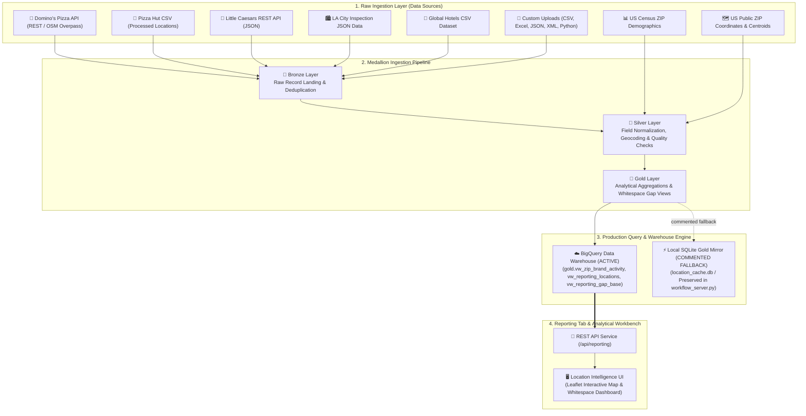

# Backend & Frontend Modular Architecture Implementation Plan

This document outlines the architectural segregation, design patterns, path resolution resolution, and exhaustive file-by-file directory structure for the **Location Intelligence Backend** (`whitespace_tool`), its **Modular Frontend UI** (`ui`), and its **Modular Unit Test Suite** (`unit_tests`).

---

## Architectural Principles & Design Patterns

The backend architecture follows **SOLID principles** and a layered separation of concerns:

```
┌─────────────────────────────────────────────────────────────────────────┐
│                      HTTP Controller / Router Layer                     │
│  (workflow_server.py, auth.routes, mapping.routes, review.routes, etc.) │
└────────────────────────────────────┬────────────────────────────────────┘
                                     │
┌────────────────────────────────────▼────────────────────────────────────┐
│                             Service Layer                               │
│  (auth.services, mapping.ingestion, templates.services, system.medallion)│
└────────────────────────────────────┬────────────────────────────────────┘
                                     │
┌────────────────────────────────────▼────────────────────────────────────┐
│                    Repository / Data Access Layer                       │
│ (persistence.warehouse_bigquery, persistence.sqlite_cache, mapping.catalog)│
└────────────────────────────────────┬────────────────────────────────────┘
                                     │
┌────────────────────────────────────▼────────────────────────────────────┐
│                Adapters, Connectors & Helper Utilities                  │
│   (source_adapters/, sources/, data_validation/, common.normalization)  │
└─────────────────────────────────────────────────────────────────────────┘
```

### 1. SOLID Principles
- **Single Responsibility Principle (SRP)**: Each package and file has one well-defined domain responsibility (Auth, Mapping, Error Review, Templates, Infrastructure, Analytics, Common, Persistence, CLI).
- **Open/Closed Principle (OCP)**: Modular route dispatchers (`handle_*_get`, `handle_*_post`) allow adding new endpoints to any domain without mutating central server code.
- **Liskov Substitution Principle (LSP)**: Interface contracts and function return types are strictly preserved across subpackages.
- **Interface Segregation Principle (ISP)**: Functions take specific inputs rather than monolithic global state objects.
- **Dependency Inversion Principle (DIP)**: Modules depend on clean abstractions and lazy bindings to prevent circular dependencies.

### 2. Repository Pattern
The **Repository Pattern** is used throughout the backend to encapsulate data access and persistence logic, decoupling business services from raw storage engines:
- **BigQuery Warehouse Repository (`whitespace_tool/persistence/warehouse_bigquery.py`)**: Manages BigQuery table schemas (`TABLE_SCHEMAS`), DDL creation, content hashing (`content_hash`), and bulk data loading (`push_to_bigquery`, `clear_dataset_tables`).
- **SQLite Local Cache Repository (`whitespace_tool/persistence/sqlite_cache.py`)**: Encapsulates SQLite caching, query cache storage (`get_cached_query`, `set_cached_query`), and local gold mirror persistence (`replace_gold_mirror`, `fetch_mirror_*`).
- **Domain Repositories (`mapping/catalog.py`, `mapping/sources.py`, `review/services.py`, `templates/services.py`)**:
  - `mapping.catalog`: Manages target field catalogs, custom field schemas, and field alias persistence.
  - `mapping.sources`: Manages brand business entity records and source type registrations.
  - `review.services`: Manages error listing records, rejection query filtering, and DML updates.
  - `templates.services`: Manages workflow template persistence and component versioning.

---

## Production-Ready Path Resolution & Asset Dispatching

To make the modularized system 100% production-ready across both frontend and backend environments:

1. **Dynamic HTTP Server Static Aliasing (`workflow_server.py`)**:
   - `workflow_server.do_GET` includes an explicit static path alias resolver mapping legacy script paths (`/constants.js`, `/login-hotfix.js`, `/js/common.js`, `/js/mapper.js`, `/js/review.js`, `/js/templates.js`) directly to `ui/facades/` scripts with `200 OK` headers.
2. **Environment-Aware Facade Script Resolution (`ui/facades/*.js`)**:
   - All facade scripts dynamically evaluate `window.location.pathname` to resolve `../<subpackage>/<file>.js` when accessed inside `/facades/` or `<subpackage>/<file>.js` when accessed from the root directory.
3. **Root-Anchored Backend Path Resolution (`whitespace_tool/`)**:
   - `workflow_server.py`, `common/storage_config.py`, `common/field_registry.py`, `templates/services.py`, `mapping/sources.py`, and `persistence/sqlite_cache.py` resolve relative file paths (`config/field_registry.json`, `config/predefined_brand_templates.json`, `config/connections/storage.json`, `config/demo.json`, `.env`, `.cache/whitespace_cache.db`, `ui/`) using `Path(__file__).resolve().parent...` root anchoring.
   - Ensures the backend server and CLI operate seamlessly regardless of the current working directory (`CWD`).

---

## Exhaustive Backend Directory Tree & File Descriptions

### Root Backend Package & Entry Points (`whitespace_tool/`)

- [__init__.py](file:///e:/Personal/nc_bye_locations_local/whitespace_tool/__init__.py): Top-level package exports, subpackage catalog documentation, and version metadata (`0.1.0`).
- [__main__.py](file:///e:/Personal/nc_bye_locations_local/whitespace_tool/__main__.py): Executable module entry point for running the CLI or server via `python -m whitespace_tool`.
- [workflow_server.py](file:///e:/Personal/nc_bye_locations_local/whitespace_tool/workflow_server.py): Central HTTP server (`MapperHandler`, `serve`) delegating request routing to domain subpackage dispatchers and serving static path aliases.

---

### Backend Compatibility Facades Subpackage (`whitespace_tool/facades/`)

- [facades/__init__.py](file:///e:/Personal/nc_bye_locations_local/whitespace_tool/facades/__init__.py): Centralized package initializer re-exporting all 13 backend facades.
- [facades/analysis.py](file:///e:/Personal/nc_bye_locations_local/whitespace_tool/facades/analysis.py): Facade re-exporting `whitespace_tool.analytics.analysis`.
- [facades/cli.py](file:///e:/Personal/nc_bye_locations_local/whitespace_tool/facades/cli.py): Facade re-exporting `whitespace_tool.cli.runner`.
- [facades/config.py](file:///e:/Personal/nc_bye_locations_local/whitespace_tool/facades/config.py): Facade re-exporting `whitespace_tool.common.config`.
- [facades/data_quality.py](file:///e:/Personal/nc_bye_locations_local/whitespace_tool/facades/data_quality.py): Facade re-exporting `whitespace_tool.analytics.data_quality`.
- [facades/field_registry.py](file:///e:/Personal/nc_bye_locations_local/whitespace_tool/facades/field_registry.py): Facade re-exporting `whitespace_tool.common.field_registry`.
- [facades/io.py](file:///e:/Personal/nc_bye_locations_local/whitespace_tool/facades/io.py): Facade re-exporting `whitespace_tool.common.io`.
- [facades/learning.py](file:///e:/Personal/nc_bye_locations_local/whitespace_tool/facades/learning.py): Facade re-exporting `whitespace_tool.analytics.learning`.
- [facades/models.py](file:///e:/Personal/nc_bye_locations_local/whitespace_tool/facades/models.py): Facade re-exporting `whitespace_tool.common.models`.
- [facades/normalization.py](file:///e:/Personal/nc_bye_locations_local/whitespace_tool/facades/normalization.py): Facade re-exporting `whitespace_tool.common.normalization`.
- [facades/sample_data.py](file:///e:/Personal/nc_bye_locations_local/whitespace_tool/facades/sample_data.py): Facade re-exporting `whitespace_tool.analytics.sample_data`.
- [facades/sqlite_cache.py](file:///e:/Personal/nc_bye_locations_local/whitespace_tool/facades/sqlite_cache.py): Facade re-exporting `whitespace_tool.persistence.sqlite_cache`.
- [facades/storage_config.py](file:///e:/Personal/nc_bye_locations_local/whitespace_tool/facades/storage_config.py): Facade re-exporting `whitespace_tool.common.storage_config`.
- [facades/warehouse_bigquery.py](file:///e:/Personal/nc_bye_locations_local/whitespace_tool/facades/warehouse_bigquery.py): Facade re-exporting `whitespace_tool.persistence.warehouse_bigquery`.

---

### Core Utilities Subpackage (`whitespace_tool/common/`)

- [common/__init__.py](file:///e:/Personal/nc_bye_locations_local/whitespace_tool/common/__init__.py): Core utilities package initializer with explicit `__all__` exports.
- [common/models.py](file:///e:/Personal/nc_bye_locations_local/whitespace_tool/common/models.py): Core dataclass definitions (`LocationRecord`, `ZipDemographics`) and UTC ISO timestamp utilities.
- [common/normalization.py](file:///e:/Personal/nc_bye_locations_local/whitespace_tool/common/normalization.py): Field parsing, string sanitization, type coercion (floats, ints, dates), and 5-digit US ZIP code cleaning.
- [common/io.py](file:///e:/Personal/nc_bye_locations_local/whitespace_tool/common/io.py): Input/Output file utilities for reading and writing JSON and CSV dataset files.
- [common/field_registry.py](file:///e:/Personal/nc_bye_locations_local/whitespace_tool/common/field_registry.py): Registry loader fetching standard platform target field definitions from `config/field_registry.json`.
- [common/config.py](file:///e:/Personal/nc_bye_locations_local/whitespace_tool/common/config.py): Configuration reader for loading demographic source configurations and environmental parameters.
- [common/storage_config.py](file:///e:/Personal/nc_bye_locations_local/whitespace_tool/common/storage_config.py): Storage credentials loader reading `storage.json` and initializing `.env` environment variables.

---

### Persistence Subpackage (`whitespace_tool/persistence/`)

- [persistence/__init__.py](file:///e:/Personal/nc_bye_locations_local/whitespace_tool/persistence/__init__.py): Persistence package initializer with explicit `__all__` exports.
- [persistence/warehouse_bigquery.py](file:///e:/Personal/nc_bye_locations_local/whitespace_tool/persistence/warehouse_bigquery.py): BigQuery data repository, schema definitions (`TABLE_SCHEMAS`), content hashing, and table ingestion engine.
- [persistence/sqlite_cache.py](file:///e:/Personal/nc_bye_locations_local/whitespace_tool/persistence/sqlite_cache.py): Repository for local SQLite query caching and gold layer mirror dataset storage.

---

### Analytics & Intelligence Subpackage (`whitespace_tool/analytics/`)

- [analytics/__init__.py](file:///e:/Personal/nc_bye_locations_local/whitespace_tool/analytics/__init__.py): Analytics package initializer with explicit `__all__` exports.
- [analytics/analysis.py](file:///e:/Personal/nc_bye_locations_local/whitespace_tool/analytics/analysis.py): Spatial deduplication, distance calculations (Haversine formula), and geographic location clustering algorithms.
- [analytics/data_quality.py](file:///e:/Personal/nc_bye_locations_local/whitespace_tool/analytics/data_quality.py): Data quality rules engine performing integrity checks (brand coverage, duplicate keys, ZIP validity, coordinate bounds).
- [analytics/learning.py](file:///e:/Personal/nc_bye_locations_local/whitespace_tool/analytics/learning.py): Machine learning auto-suggestion service suggesting mapping candidates based on historical workflow templates.
- [analytics/sample_data.py](file:///e:/Personal/nc_bye_locations_local/whitespace_tool/analytics/sample_data.py): Synthetic benchmark sample dataset generators for QA testing and product demonstration.

---

### CLI Controller Subpackage (`whitespace_tool/cli/`)

- [cli/__init__.py](file:///e:/Personal/nc_bye_locations_local/whitespace_tool/cli/__init__.py): CLI package initializer with explicit `__all__` exports.
- [cli/runner.py](file:///e:/Personal/nc_bye_locations_local/whitespace_tool/cli/runner.py): Command-Line Interface (CLI) runner executing mapping analysis, quality checks, and BigQuery loading from terminal.

---

### Domain Subpackage 1: Auth & Security (`whitespace_tool/auth/`)

- [auth/__init__.py](file:///e:/Personal/nc_bye_locations_local/whitespace_tool/auth/__init__.py): Auth subpackage exports (`authenticate`, `handle_auth_post`).
- [auth/services.py](file:///e:/Personal/nc_bye_locations_local/whitespace_tool/auth/services.py): Service logic for user credential authentication and environment password verification.
- [auth/routes.py](file:///e:/Personal/nc_bye_locations_local/whitespace_tool/auth/routes.py): Controller router handling HTTP POST requests for `/api/login`.

---

### Domain Subpackage 2: Source Mapping & Ingestion (`whitespace_tool/mapping/`)

- [mapping/__init__.py](file:///e:/Personal/nc_bye_locations_local/whitespace_tool/mapping/__init__.py): Mapping subpackage exports (re-exports catalog, source, ingestion services).
- [mapping/catalog.py](file:///e:/Personal/nc_bye_locations_local/whitespace_tool/mapping/catalog.py): Repository for field catalog queries, standard field target lists (`mapper_targets`), custom field DML (`create_custom_field`, `delete_custom_field`), and field alias mapping (`add_field_alias`).
- [mapping/sources.py](file:///e:/Personal/nc_bye_locations_local/whitespace_tool/mapping/sources.py): Source preview generator (`preview_source`), Excel sheet lister (`source_sheets`), public HTTP source fetcher (`fetch_public_source`), Domino's API integration (`dominos_source`), brand repository (`list_brands`, `create_brand`), and US ZIP reference preparation (`prepare_zipcodes`).
- [mapping/ingestion.py](file:///e:/Personal/nc_bye_locations_local/whitespace_tool/mapping/ingestion.py): Data ingestion pipeline service (`save_mapper`), mapper configuration validator (`validate_mapper`), mapper credential scrubber (`_scrub_mapper`), row error generator (`_row_error_listing`), bronze deduplication (`_dedupe_listings_against_bronze`), and mapping auto-learning service (`learn_mappings`).
- [mapping/routes.py](file:///e:/Personal/nc_bye_locations_local/whitespace_tool/mapping/routes.py): Controller router handling HTTP GET/POST endpoints (`/api/schema`, `/api/field-registry`, `/api/prepare`, `/api/preview`, `/api/source-url`, `/api/sheets`, `/api/save`, `/api/brands`, `/api/learning`, `/api/field-alias`, `/api/custom-field`, `/api/custom-field/delete`, `/api/dominos-source`).

---

### Domain Subpackage 3: Error Review & Rejected Records (`whitespace_tool/review/`)

- [review/__init__.py](file:///e:/Personal/nc_bye_locations_local/whitespace_tool/review/__init__.py): Review subpackage exports (`list_rejected`, `count_error_listings`, `reprocess_rejected`).
- [review/services.py](file:///e:/Personal/nc_bye_locations_local/whitespace_tool/review/services.py): Service & repository logic querying active error listings (`list_rejected`), error counts (`count_error_listings`), rejected record reprocessing (`reprocess_rejected`), and DML error table soft-deletions.
- [review/routes.py](file:///e:/Personal/nc_bye_locations_local/whitespace_tool/review/routes.py): Controller router handling HTTP GET/POST endpoints (`/api/rejected`, `/api/error-listings/count`, `/api/reprocess`).

---

### Domain Subpackage 4: Template Library (`whitespace_tool/templates/`)

- [templates/__init__.py](file:///e:/Personal/nc_bye_locations_local/whitespace_tool/templates/__init__.py): Template library subpackage exports (`predefined_templates`, `list_templates`, `save_template_version`).
- [templates/services.py](file:///e:/Personal/nc_bye_locations_local/whitespace_tool/templates/services.py): Service & repository logic loading built-in predefined brand templates (`predefined_templates`), querying saved workflow templates (`list_templates`), and saving updated template component versions (`save_template_version`).
- [templates/routes.py](file:///e:/Personal/nc_bye_locations_local/whitespace_tool/templates/routes.py): Controller router handling HTTP GET/POST endpoints (`/api/predefined-templates`, `/api/templates`, `/api/templates/save`).

---

### Domain Subpackage 5: System Administration & Medallion Pipeline (`whitespace_tool/system/`)

- [system/__init__.py](file:///e:/Personal/nc_bye_locations_local/whitespace_tool/system/__init__.py): System subpackage exports (storage, medallion ETL).
- [system/storage.py](file:///e:/Personal/nc_bye_locations_local/whitespace_tool/system/storage.py): Service logic for warehouse ping probes (`ping_storage_connection`), storage connection testing (`test_storage_connection`), health probe recording (`_write_connection_health_probe`), and clearing dataset tables (`clear_saved_data`).
- [system/medallion.py](file:///e:/Personal/nc_bye_locations_local/whitespace_tool/system/medallion.py): Medallion architecture ETL orchestrator building silver enriched tables (`build_silver_layer`), gold analytical views (`build_gold_layer`), local SQLite mirror syncing (`sync_gold_mirror`), background refresh thread (`_refresh_silver_background`), and periodic scheduler (`_start_silver_gold_scheduler`).
- [system/routes.py](file:///e:/Personal/nc_bye_locations_local/whitespace_tool/system/routes.py): Controller router handling HTTP GET/POST endpoints (`/api/ping`, `/api/storage/test`, `/api/clear`, `/api/silver/enrich`).

---

### Domain Subpackage 6: Reporting & Analytics (`whitespace_tool/reporting/`)

- [reporting/__init__.py](file:///e:/Personal/nc_bye_locations_local/whitespace_tool/reporting/__init__.py): Reporting subpackage exports (`reporting_summary`, `geo_options`, `search_zips`, etc.).
- [reporting/api.py](file:///e:/Personal/nc_bye_locations_local/whitespace_tool/reporting/api.py): Analytical reporting service executing whitespace calculations, market share metrics, geographic options, and ZIP code search queries.
- [reporting/helpers.py](file:///e:/Personal/nc_bye_locations_local/whitespace_tool/reporting/helpers.py): Pure statistical helpers for CSV parameters, median values, share percentages, percentage differences, and geographic boundary filters.
- [reporting/routes.py](file:///e:/Personal/nc_bye_locations_local/whitespace_tool/reporting/routes.py): Controller router handling HTTP GET/POST endpoints (`/api/reporting`, `/api/geo/options`, `/api/zips/search`, `/api/sample/status`, `/api/reporting/refresh`, `/api/sample/load`).

---

### Support Subpackages

#### Data Validation Subpackage (`whitespace_tool/data_validation/`)
- [data_validation/__init__.py](file:///e:/Personal/nc_bye_locations_local/whitespace_tool/data_validation/__init__.py): Exports for validation rules (`validate_normalized_location`, `validate_source_row`).
- [data_validation/fields.py](file:///e:/Personal/nc_bye_locations_local/whitespace_tool/data_validation/fields.py): Validation logic checking field formats (ZIP code regex, state codes, lat/long numerical ranges).

#### Source Adapters Subpackage (`whitespace_tool/source_adapters/`)
- [source_adapters/__init__.py](file:///e:/Personal/nc_bye_locations_local/whitespace_tool/source_adapters/__init__.py): Adapter subpackage exports.
- [source_adapters/common.py](file:///e:/Personal/nc_bye_locations_local/whitespace_tool/source_adapters/common.py): Shared adapter utilities and field inspection helpers.
- [source_adapters/csv_source.py](file:///e:/Personal/nc_bye_locations_local/whitespace_tool/source_adapters/csv_source.py): CSV format file parser and preview generator.
- [source_adapters/excel_source.py](file:///e:/Personal/nc_bye_locations_local/whitespace_tool/source_adapters/excel_source.py): Excel (.xlsx/.xls) workbook reader, sheet navigator, and preview generator.
- [source_adapters/json_source.py](file:///e:/Personal/nc_bye_locations_local/whitespace_tool/source_adapters/json_source.py): JSON file and record path array parser.
- [source_adapters/xml_source.py](file:///e:/Personal/nc_bye_locations_local/whitespace_tool/source_adapters/xml_source.py): XML document tag parser and row record generator.
- [source_adapters/api_get_source.py](file:///e:/Personal/nc_bye_locations_local/whitespace_tool/source_adapters/api_get_source.py): External REST API GET JSON response preview and data fetcher.
- [source_adapters/python_connector_source.py](file:///e:/Personal/nc_bye_locations_local/whitespace_tool/source_adapters/python_connector_source.py): Python code connector sandbox runner for custom data extraction scripts.

#### Data Source Connectors Subpackage (`whitespace_tool/sources/`)
- [sources/__init__.py](file:///e:/Personal/nc_bye_locations_local/whitespace_tool/sources/__init__.py): Data source connector exports.
- [sources/csv_locations.py](file:///e:/Personal/nc_bye_locations_local/whitespace_tool/sources/csv_locations.py): Generic CSV location file ingestion connector.
- [sources/demographics.py](file:///e:/Personal/nc_bye_locations_local/whitespace_tool/sources/demographics.py): BigQuery US census demographics connector and query executor.
- [sources/dominos_api.py](file:///e:/Personal/nc_bye_locations_local/whitespace_tool/sources/dominos_api.py): Domino's store locator REST API client.
- [sources/dominos_overpass.py](file:///e:/Personal/nc_bye_locations_local/whitespace_tool/sources/dominos_overpass.py): Domino's OpenStreetMap Overpass API fallback connector.
- [sources/dominos_store_locator.py](file:///e:/Personal/nc_bye_locations_local/whitespace_tool/sources/dominos_store_locator.py): Domino's store locator ZIP code web crawler and store parser.
- [sources/little_caesars_json.py](file:///e:/Personal/nc_bye_locations_local/whitespace_tool/sources/little_caesars_json.py): Little Caesars JSON location data connector.
- [sources/pizza_hut_kaggle.py](file:///e:/Personal/nc_bye_locations_local/whitespace_tool/sources/pizza_hut_kaggle.py): Pizza Hut Kaggle dataset parser and transformer.
- [sources/public_us_zips_bigquery.py](file:///e:/Personal/nc_bye_locations_local/whitespace_tool/sources/public_us_zips_bigquery.py): BigQuery public US ZIP codes reference dataset connector.

---

## Modular Unit Test Suite Directory Tree (`unit_tests/`)

The test suite is organized into subpackages corresponding directly to backend components:

- `unit_tests/__init__.py`: Unit test root package initializer.
- `unit_tests/common/`:
  - `test_storage_config.py`: Unit tests for `whitespace_tool.common.storage_config`.
- `unit_tests/persistence/`:
  - `test_warehouse_schema.py`: Unit tests for `whitespace_tool.persistence.warehouse_bigquery`.
  - `test_content_hash.py`: Unit tests for deterministic content hashing.
  - `test_bigquery_bootstrap.py`: Unit tests for BigQuery DDL schema creation.
- `unit_tests/analytics/`:
  - `test_sample_data.py`: Unit tests for `whitespace_tool.analytics.sample_data`.
  - `test_demo_data_validation.py`: Unit tests for `whitespace_tool.analytics.data_quality`.
- `unit_tests/system/`:
  - `test_clear_saved_data.py`: Unit tests for `whitespace_tool.system.storage`.
  - `test_silver_enrichment.py`: Unit tests for `whitespace_tool.system.medallion`.
  - `test_gold_layer.py`: Unit tests for `whitespace_tool.system.medallion`.
  - `test_scheduler.py`: Unit tests for `whitespace_tool.system.medallion`.
- `unit_tests/reporting/`:
  - `test_reporting_cache.py`: Unit tests for `whitespace_tool.reporting.api`.
  - `test_gold_mirror.py`: Unit tests for `whitespace_tool.persistence.sqlite_cache` and mirror sync.
- `unit_tests/mapping/`:
  - `test_csv_workflow.py`: Unit tests for `whitespace_tool.mapping.ingestion`.
  - `test_remote_source_limits.py`: Unit tests for `whitespace_tool.mapping.sources`.
- `unit_tests/sources/`:
  - `test_dominos_overpass.py`: Unit tests for `whitespace_tool.sources.dominos_overpass`.
  - `test_dominos_store_locator.py`: Unit tests for `whitespace_tool.sources.dominos_store_locator`.
- `unit_tests/source_adapters/`:
  - `test_python_connector.py`: Unit tests for `whitespace_tool.source_adapters.python_connector_source`.

---

## Modular Frontend UI Directory Tree (`ui/`)

The frontend user interface is modularized into domain subpackages corresponding directly to the backend subpackage endpoints, with `ui/index.html` operating as a lightweight HTML shell that asynchronously loads modular HTML, CSS, and JS components from each domain subpackage:

- `ui/index.html`: Project default Single-Page Application (SPA) shell with container slots for module partials.
- `ui/integrations.html`: Forwarding redirect to `index.html` for backward compatibility.
- `ui/facades/`:
  - `constants.js`: UI facade re-exporting `ui/common/constants.js`.
  - `login-hotfix.js`: UI facade re-exporting `ui/auth/auth.js`.
  - `common.js`: UI facade re-exporting `ui/common/common.js`.
  - `mapper.js`: UI facade re-exporting `ui/mapping/mapping.js`.
  - `review.js`: UI facade re-exporting `ui/review/review.js`.
  - `templates.js`: UI facade re-exporting `ui/templates/templates.js`.
- `ui/common/`:
  - `common.html`, `header.html`, `footer.html`: Header navigation, footer, loading overlay, and Python editor dialog HTML markup.
  - `common.css`: Base CSS reset, layout variables, header, tabs, buttons, loading overlay, status panels, and dialog styles.
  - `common.js`: Shared DOM helpers, formatting, loading overlays, status messaging, and view tab navigation handlers.
  - `constants.js`: Application constants, session keys, and element IDs.
  - `loader.js`: Modular UI component loader fetching HTML partials asynchronously on application load.
- `ui/auth/`:
  - `auth.html`: Login screen modal container and authentication form HTML markup.
  - `auth.css`: Login screen container, credential inputs, password toggle, and auth status styles.
  - `auth.js`: Login session handler, authentication modal, and backend `/api/login` controller communication.
- `ui/mapping/`:
  - `mapping.html`: Source controls, brand selector, file upload, field mapping grid, optional fields picker, and data model preview HTML markup.
  - `mapping.css`: Source mapping grid, optional field picker, save tooltip wrapper, JSON viewer panel, and Python/Monaco editor dialog.
  - `mapping.js`: Source onboarding, mapping targets, custom field manager, draft save/restore, and backend mapping endpoints (`/api/save`, `/api/preview`, `/api/brands`, `/api/schema`, `/api/field-registry`, `/api/source-url`, `/api/sheets`, `/api/learning`, `/api/field-alias`, `/api/custom-field`, `/api/custom-field/delete`, `/api/dominos-source`).
- `ui/review/`:
  - `review.html`: Rejected records table and edit record modal HTML markup.
  - `review.css`: Rejected records toolbar, search inputs, status badges, and edit record dialog.
  - `review.js`: Rejected records listing, edit & retry record modal, and review endpoints (`/api/rejected`, `/api/reprocess`, `/api/error-listings/count`).
- `ui/templates/`:
  - `templates.html`: Template library search bar, business/source filters, and templates grid HTML markup.
  - `templates.css`: Template library layout, brand filter pills, card grid, and version editor.
  - `templates.js`: Predefined brand templates, brand filters, saved template loader/editor, and template endpoints (`/api/predefined-templates`, `/api/templates`, `/api/templates/save`).
- `ui/system/`:
  - `system.html`: Storage health status and data deletion confirmation dialog HTML markup.
  - `system.css`: System administration panel and storage health probe card styles.
  - `system.js`: Readiness ping probe, header status updates, storage connection test/reset, and system endpoints (`/api/ping`, `/api/prepare`, `/api/storage/test`, `/api/clear`).
- `ui/reporting/`:
  - `reporting.html`: Reporting hero banner, state/county/city/ZIP filter bars, Leaflet map container, market metrics grid, top states cards, and market gaps table HTML markup.
  - `reporting.css`: Reporting hero banner, market metric cards, filter dropdowns, Leaflet map container, state/city distribution charts, and market gap tables.
  - `reporting.core.js`: Core reporting state and analytical calculations.
  - `reporting.tabs.js`: Multi-tab rendering for summary metrics, market share, and whitespace analysis.
  - `reporting.wiring.js`: Event listeners and backend API integration (`/api/reporting`, `/api/geo/options`, `/api/zips/search`, `/api/sample/status`, `/api/reporting/refresh`, `/api/sample/load`).

---

## Centralized Compatibility Facades (`whitespace_tool/facades/` & `ui/facades/`)

### 1. Architectural Rationale & Separation of Concerns

During the modular refactoring, all internal business logic and unit tests were updated to import directly from domain subpackages (e.g., `whitespace_tool.common.normalization`, `whitespace_tool.persistence.sqlite_cache`, `ui/common/constants.js`, `ui/auth/auth.js`).

To ensure **zero breaking changes** for legacy integrations, external scripts, or bookmarks without cluttering top-level project directories, all backward-compatibility facade files were consolidated into dedicated facade packages:
1. **Backend Facades Subpackage (`whitespace_tool/facades/`)**: Houses all 13 Python re-export modules.
2. **Frontend Facades Directory (`ui/facades/`)**: Houses all 6 JavaScript polyfill/loader facade scripts.

---

### 2. Backend Facades Mapping Table (`whitespace_tool/facades/`)

| Facade Module | Canonical Subpackage Source | Re-exported Symbols / Functionality | Purpose & Rationale |
| :--- | :--- | :--- | :--- |
| `facades/analysis.py` | `whitespace_tool.analytics.analysis` | `analyze_whitespace`, `dedupe_locations`, `haversine_distance` | Compatibility wrapper for spatial analysis. |
| `facades/cli.py` | `whitespace_tool.cli.runner` | `main`, `run_analysis`, `run_quality_check` | CLI command entrypoint facade. |
| `facades/config.py` | `whitespace_tool.common.config` | `load_config`, `parse_demo_config` | Configuration loading wrapper. |
| `facades/data_quality.py` | `whitespace_tool.analytics.data_quality` | `run_quality_checks`, `generate_quality_report` | Data quality assertions facade. |
| `facades/field_registry.py` | `whitespace_tool.common.field_registry` | `load_field_registry`, `get_field_spec` | Target field schema registry facade. |
| `facades/io.py` | `whitespace_tool.common.io` | `write_csv`, `write_json`, `read_json` | File read/write utilities facade. |
| `facades/learning.py` | `whitespace_tool.analytics.learning` | `suggest_from_templates`, `extract_mapping_patterns` | Machine learning mapper auto-suggestion facade. |
| `facades/models.py` | `whitespace_tool.common.models` | `LocationRecord`, `ZipDemographics`, `utc_now_iso` | Dataclass definitions and timestamp facade. |
| `facades/normalization.py` | `whitespace_tool.common.normalization` | `normalize_location`, `clean_zip`, `optional_float` | Field sanitization and type coercion facade. |
| `facades/sample_data.py` | `whitespace_tool.analytics.sample_data` | `generate_source_rows`, `SAMPLE_BRANDS` | Benchmark synthetic data generator facade. |
| `facades/sqlite_cache.py` | `whitespace_tool.persistence.sqlite_cache` | `get_cached_query`, `set_cached_query`, `invalidate_cache` | SQLite WAL query cache & gold mirror facade. |
| `facades/storage_config.py` | `whitespace_tool.common.storage_config` | `load_storage_config`, `load_dotenv` | Credentials and `.env` storage config facade. |
| `facades/warehouse_bigquery.py` | `whitespace_tool.persistence.warehouse_bigquery` | `push_to_bigquery`, `content_hash`, `TABLE_SCHEMAS` | BigQuery warehouse repository facade. |
| `facades/__init__.py` | `whitespace_tool.facades.*` | All 13 facade modules above | Central index package for all backend facades. |

---

### 3. Frontend Facades Mapping Table (`ui/facades/`)

| Facade Script | Canonical Subpackage Source | Mechanism / Pattern | Purpose & Rationale |
| :--- | :--- | :--- | :--- |
| `ui/facades/constants.js` | `ui/common/constants.js` | DOM Dynamic Script Injector | Polyfill wrapper ensuring `window.APP_CONSTANTS` is available globally. |
| `ui/facades/login-hotfix.js` | `ui/auth/auth.js` | Async DOM Script Injector | Hotfix wrapper ensuring `auth/auth.js` is loaded into the `<head>` if missing. |
| `ui/facades/common.js` | `ui/common/common.js` | Script Re-export | Legacy path facade for shared DOM utilities and view routing handlers. |
| `ui/facades/mapper.js` | `ui/mapping/mapping.js` | Script Re-export | Legacy path facade for source parsing, field mapping, and draft save/restore. |
| `ui/facades/review.js` | `ui/review/review.js` | Script Re-export | Legacy path facade for rejected listing error queries and record reprocessing. |
| `ui/facades/templates.js` | `ui/templates/templates.js` | Script Re-export | Legacy path facade for predefined brand templates and template catalog. |

---

### 4. Dependency Decoupling & Invocation Audit

1. **Subpackage Independence**:
   - Internal backend subpackages (`whitespace_tool/common/`, `persistence/`, `analytics/`, `mapping/`, `system/`, `reporting/`, `auth/`, `review/`, `templates/`, `data_validation/`, `sources/`, `source_adapters/`) **never import from facades**. They import directly from canonical subpackages.
2. **Unit Test Suite Independence**:
   - All 123 unit tests under `unit_tests/` import directly from `whitespace_tool.<subpackage>.<module>` without calling facade modules.
3. **Frontend SPA Autonomy**:
   - The browser UI (`ui/index.html` shell and domain partials in `ui/common/`, `ui/auth/`, `ui/mapping/`, etc.) communicates exclusively via REST API endpoints (`/api/*`) and loads modular scripts directly from domain folders, requiring facades only as fallback polyfills.

---

## Verification Plan

### Automated Tests
- Run full test suite discovery command:
  ```bash
  python -m unittest discover -s unit_tests
  ```
- **Results**: All 123 unit tests pass cleanly in ~1.6 seconds without errors or warnings.

### Manual Verification
- Start local workflow server: `python -m whitespace_tool workflow-ui --port 8765`.
- Verify UI application shell, module partial injection (`loader.js`), login authentication, mapping preview, template catalog, error review, and analytical reporting.

---

### Responsible Connection File
- **File**: `whitespace_tool/workflow_server.py` (`reporting_summary()`, lines 2286–2370)
- **Routing**: Points directly to **BigQuery Analytics Views** (`gold.vw_zip_brand_activity`, `gold.vw_reporting_locations`, `gold.vw_reporting_gap_base`). The SQLite Gold Mirror (`location_cache.db`) check is retained as a commented fallback.



